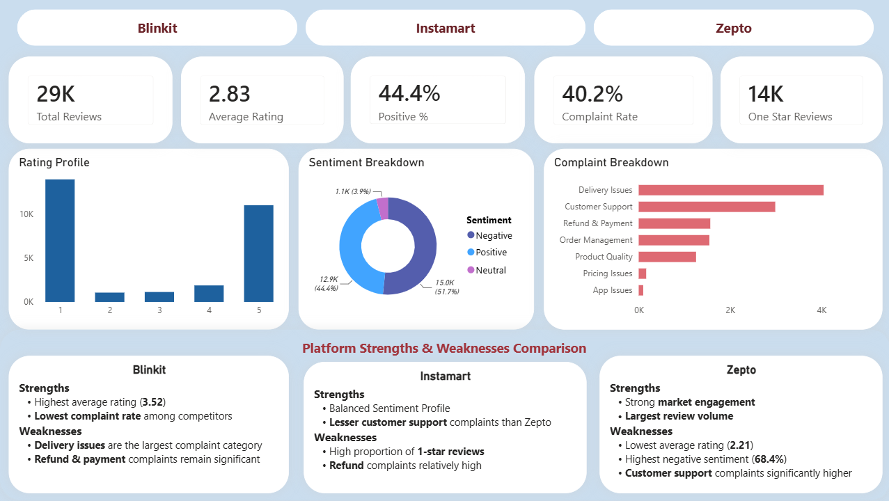

# 🛒 Quick Commerce Customer Experience Analytics

An end-to-end data analytics project that analyzes customer reviews from Blinkit, Instamart, and Zepto to understand customer sentiment, identify common complaints, and generate business insights using Python and Power BI.

---

## 📊 Dashboard Preview

This project features a **4-page interactive Power BI dashboard** . The complete dashboard availabe in the `Dashboard` folder.

Preview of one dashboard page:



---

## 🎯 Project Objectives

- Analyze customer sentiment across quick commerce platforms.
- Identify the most common customer complaints.
- Compare platform performance using customer reviews.
- Build an interactive Power BI dashboard.
- Provide data-driven business recommendations.

---

## 🛠️ Tech Stack

| Category | Tools |
|----------|-------|
| Language | Python |
| Libraries | Pandas, scikit-learn, google-play-scraper |
| Data Visualization | Power BI |
| Power BI Features | Power Query, DAX |

---

## 🔄 Project Workflow

```text
Review Collection
        │
        ▼
Data Cleaning & Preprocessing
        │
        ▼
EDA & Sentiment Analysis
        │
        ▼
Complaint Categorization
        │
        ▼
Power BI Dashboard
        │
        ▼
Business Insights
```

---

## 📊 Dataset

- Source: Google Play Store Reviews
- Platforms: Blinkit, Instamart, Zepto
- Data collected using `google-play-scraper`
- Includes ratings, review text, review date, and other metadata

---

## ▶️ How to Run

```bash
# Clone the repository
git clone https://github.com/Altamash0008/Quick-Commerce-Customer-Experience-Analytics.git

# Navigate to the project
cd Quick-Commerce-Customer-Experience-Analytics

# Install dependencies
pip install -r requirements.txt

# Run data preparation file
python Scripts/Data_preparation.py

# Run exploratory data analysis file
python Scripts/eda.py

# Run complaint analysis file
python Scripts/complaint_analysis.py
```

---

## 📈 Dashboard Highlights

- Customer sentiment analysis
- Platform comparison
- Rating distribution
- Complaint category analysis
- Business insights and recommendations

---

## 💡 Key Insights

- Compared customer sentiment across platforms.
- Identified major complaint categories from reviews.
- Analyzed rating distribution and review trends.
- Built an interactive dashboard for business decision-making.
- Suggested recommendations to improve customer experience.

---

## 👤 Author

**Mohammad Altamash**

GitHub: https://github.com/Altamash0008
